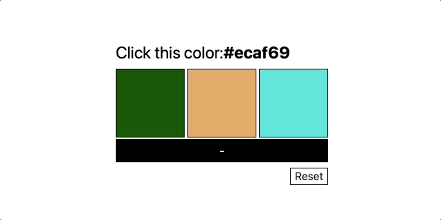

# Color Challenge 🎨🧠💡

This challenge is adapted from Client.dev and designed to test your knowledge of React, JavaScript, and UI development.

## Challenge Overview 🟥🟩🟦

Your goal is to build a color guessing game:

- Display **three random color swatches** (100px x 100px squares).
- Below the swatches, show the **hex value** of *one* of them.
- When a swatch is clicked:
  - If it matches the displayed hex color, show **"correct"**.
  - Otherwise, show **"incorrect"**.
- Include a **Reset / Play Again** button.

Your finished project should look and function similar to this: 

---

## How to Use AI Responsibly for This Assignment 🤖

You are encouraged to use AI tools like ChatGPT for:

- ✅ **Debugging:** Explaining error messages or why something isn’t working.
- ✅ **Code review:** Getting feedback on your functions, logic, or readability.
- ✅ **References:** Looking up syntax, React APIs, or CSS properties.

You should **not** use AI to: 

- ❌ Generate the entire solution from a single prompt.
- ❌ Copy and paste full implementations without understanding them.
- ❌ Replace your own reasoning and trial-and-error problem solving.

### Reflection Requirement 🧠

Include a short section in the **readme** of your submission: 

- 2-3 prompts you asked AI
- A sentence or two on how AI helped (debugging, design, etc.)
- One thing you figured out on your own

This ensures that AI use supports your learning, not replaces it!

---

## Planning and Strategy 🗺️

You don’t need to solve everything at once. Break it down:

### 1. Build the Interface 🏗️

- Create a React app
- Add three 100x100 square divs (use border/background-color to make them visible)
- Arrange the squares in a row
- Below, show a placeholder hex color
- Add "Correct/Incorrect" message area (initially empty)
- Add a reset button
- Arrange everything vertically (below the row of squares)

### 2. Generate Random Colors 🎲

- Hex colors look like: `#AABBCC`
- Each pair (AA, BB, CC) is a number 0-255 converted to hex

Steps:

1. Write a function that returns a random number from 0 to 255
2. Use it to generate a hex color string (0-255 is the equivalent to 00-FF in hexadecimal)
3. Create three random colors in state
4. Apply them using React inline styles

### 3. Handle Interaction and Logic 🧠

- When a swatch is clicked, check if it matches the target color
- Show "correct" or "incorrect"
- Track and display the result using state
- Reset button should:
  - Generate new colors
  - Pick a new target
  - Clear result

---

## Stretch Goals 🏁

- Add a hover state and cursor pointer to swatches
- Highlight the correct swatch after a wrong guess
- Reveal the hex value on each swatch after answering
- Add a short countdown before showing swatches

---

## Submission ✅

- Include the **AI Reflection** section in your readme
- Optional: Explain your component structure or design decisions 
- Commit and push your work to GitHub
- Submit your assignment to GradeScope. 
