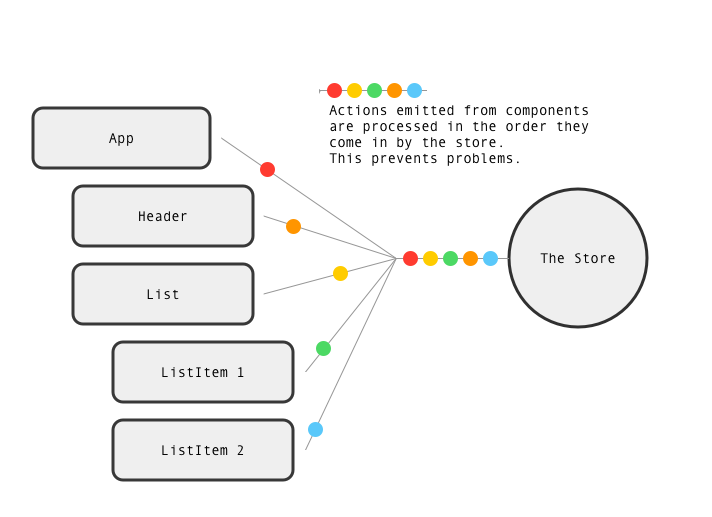

# 🧱 ACS 3330 – Lesson 9: Advanced Redux with Redux Toolkit

## 📝 Overview
In this lesson, you'll reinforce Redux fundamentals and learn how to streamline state management using **Redux Toolkit**. You'll convert traditional Redux patterns into slices, handle asynchronous logic with `createAsyncThunk`, and build a clean architecture using multiple slices.

---

## 🎯 Learning Goals
- Refactor a basic reducer into a slice using `createSlice`
- Handle asynchronous data fetching using `createAsyncThunk`
- Manage multiple slices in a Redux store
- Build selectors to derive computed state
- Apply Redux best practices for scalable apps
- Understand and apply the concept of **unidirectional data flow**
- Understand the concept of a **reducer** from a computer science perspective

---

## The problems and solution
Flux and Redux were created to solve a problem. The simple approach is to store application state as component state. This entails lifting state to a parent component so it can be passed down to child components. 


The image above shows how state, stored in App, might have to be passed as props to child components down the component tree. 

Another headache for React developers is passing data up the component tree. Its easy to pass data down the tree via props. Passing data up the tree most often requires a function be passed down that executes at parent component. 


## The solution

In a Redux app state is placed in the store, which sits outside of the component tree. Any component can access the store directly, without passing props. 


## Redictable Data
Redux describes itself as a "redictable state container". Changes to state can only be made by sending actions, and these actions are all processed in order. 



---

## 1️⃣ Recap: Redux Fundamentals

### 🔐 Single Source of Truth
Redux applications are built on the principle of having a **single source of truth** — one central store that holds all application state.

Why this matters:
- It allows consistent, centralized access to state from any component.
- It avoids bugs caused by duplicated or out-of-sync state.
- It simplifies debugging and testing by isolating where and how state changes.

In Redux, the `store` acts as this single source, and all state changes flow through reducers.

💡 **AI Prompt:** "What is a single source of truth in state management and why is it important?"

### 🔁 What is Unidirectional Data Flow?
Unidirectional data flow is a design pattern where **data moves in a single direction** throughout the app. In Redux, this helps maintain predictable state changes and makes debugging easier.

Here’s how it works:
1. A user **interacts with the UI** (clicks a button, types into a form)
2. The UI **dispatches an action** describing the intent (e.g., `ADD_ITEM`)
3. A **reducer handles the action** and returns new state
4. The **store is updated**, and any components that depend on that state re-render

This loop looks like:
```
UI → dispatch → reducer → store → UI
```

Because each step is isolated and data flows in only one direction, it becomes much easier to trace bugs, write tests, and reason about state in your app.

💡 **AI Prompt:** “What are the benefits of unidirectional data flow in large applications?”

- A Redux store holds global application state
- Components dispatch **actions** that describe state changes
- **Reducers** return new state based on action type and payload
- Components access state with `useSelector`
- Redux follows a **unidirectional data flow** model:
  ```
  UI → dispatch → reducer → store → UI
  ```

### 🧠 What is a Reducer?
In computer science, a **reducer** is a type of function that takes a collection (like an array) and "reduces" it to a single result by applying a transformation. In JavaScript, you've used this pattern with `.reduce()`:

```js
const total = numbers.reduce((acc, value) => acc + value, 0)
```

In Redux, a **reducer** is a pure function that:
- Takes the current state and an action
- Returns a new version of the state (if the state is changed)

📌 **Important:** In Redux, you must return a new version of the state if it is modified. Simply mutating the existing state will not trigger updates.

💡 However, **Redux Toolkit** uses the **Immer** library under the hood, which allows you to write code that appears to mutate state directly, while safely creating new immutable state behind the scenes.

This pattern ensures that state changes are **predictable**, **testable**, and **traceable**.


The image above shows: 
- An event dispatches an action
- The action and state are passed the reducer, which updates state
- Updated state is passed to the user interface

Watch teh animation and find these things! 

💡 **AI Prompt:** “In Dedux what is a reducer?”
💡 **AI Prompt:** “In Redux what is an action?”
💡 **AI Prompt:** “In Redux how does an action change state?”
💡 **AI Prompt:** “In Redux can state be chnaged without an action?”
💡 **AI Prompt:** “What makes a Redux reducer pure?”
💡 **AI Prompt:** “What is unidirectional data flow and why is it useful in Redux?”
💡 **AI Prompt:** “What is a reducer in functional programming, and how does that apply to Redux?”


---

## 2️⃣ Why Redux Toolkit?
Redux Toolkit (RTK) reduces boilerplate and encourages best practices:
- `configureStore()` simplifies store setup
- `createSlice()` automatically generates action creators and reducers
- `createAsyncThunk()` handles async logic like API calls

📚 Learn more: [Redux Toolkit Docs](https://redux-toolkit.js.org/)

💡 **AI Prompt:** “How does createSlice simplify Redux logic?”

---

## 3️⃣ Refactor a Reducer with `createSlice`
Start with a basic `cartReducer` and refactor into a slice:

```js
// redux/cartSlice.js
import { createSlice } from '@reduxjs/toolkit'

const cartSlice = createSlice({
  name: 'cart',
  initialState: [], // initial state is an empty array
  reducers: {
    // This slice has two 
    addItem: (state, action) => {
      state.push(action.payload)
    },
    removeItem: (state, action) => {
      return state.filter(item => item.id !== action.payload.id)
    }
  }
})

export const { addItem, removeItem } = cartSlice.actions
export default cartSlice.reducer
```

📌 Redux Toolkit uses **Immer** internally to allow “mutating” state safely.

💡 **AI Prompt:** “What does immutable mean in computer science?”
💡 **AI Prompt:** “In redux is state immutable?”
💡 **AI Prompt:** “In redux why is state immutable?”

---

## 4️⃣ Handle Async with `createAsyncThunk`
Asynchronous actions in Redux are handled in a special way, using a "thunk". 

Use `createAsyncThunk` to fetch data from an API (e.g. product list).

```js
redux/weatherSlice.js
import { createSlice, createAsyncThunk } from '@reduxjs/toolkit'

// This is your async action
export const fetchWeather = createAsyncThunk('weather/fetch', async (zip) => {
  const apikey = import.meta.env.VITE_API_KEY
  const res = await fetch(`https://api.openweathermap.org/data/2.5/weather?zip=${zip}&appid=${apikey}&units=imperial`)
  return await res.json()
})

const weatherSlice = createSlice({
  name: 'weather',
  initialState: {
    weather: null,
    status: 'idle',
    error: null
  },
  reducers: {},
  // Async actions are handled in extraReducer
  extraReducers: (builder) => {
    // Add cases for states pending, fulfilled, and rejected
    builder
      .addCase(fetchWeather.pending, (state) => {
        state.status = 'loading'
      })
      .addCase(fetchWeather.fulfilled, (state, action) => {
        state.status = 'succeeded'
        state.weather = action.payload
      })
      .addCase(fetchWeather.rejected, (state, action) => {
        state.status = 'failed'
        state.error = action.error.message
      })
  }
})

export default weatherSlice.reducer
```

💡 **AI Prompt:** “How do I use createAsyncThunk in Redux Toolkit?”
💡 **AI Prompt:** “What is a Thunk in computer science?”

Read more about `createAsyncThunk`: https://redux-toolkit.js.org/api/createAsyncThunk

---

## 5️⃣ Configure the Store

```js
// redux/store.js
import { configureStore } from '@reduxjs/toolkit'
import cartReducer from './cartSlice'
import productsReducer from './productsSlice'

export const store = configureStore({
  reducer: {
    cart: cartReducer,
    products: productsReducer
  }
})
```

Then wrap your app with the Redux provider:
```js
import { Provider } from 'react-redux'
import { store } from './redux/store'

<Provider store={store}>
  <App />
</Provider>
```

The `Provider` component allows the `useSelector` and `useDispatch` hooks to function. It must be placed at the top of the component tree. 

💡 **AI Prompt:** “What a Provider component?”

---

## ✅ Recap: What You Learned
| Concept            | Tool/Pattern |
|--------------------|--------------|
| Action Creators    | `createSlice()` |
| Async API Fetching | `createAsyncThunk()` |
| Store Setup        | `configureStore()` |
| State Access       | `useSelector()` |
| Dispatching Actions| `useDispatch()` |
| Data Flow Model    | Unidirectional flow |
| Reducer Pattern    | Functional reducer logic |

💡 **AI Prompt:** “What’s the best way to structure slices in a large Redux app?”

---

## 🧪 Challenge Project: Product Store
Create a small product store app using:
- `createSlice()` for cart logic
- `createAsyncThunk()` for loading products
- Display loading and error states
- Show totals in cart using `reduce`

---

## 📚 Resources
- [Redux Toolkit Docs](https://redux-toolkit.js.org/)
- [Redux Fundamentals Tutorial](https://redux.js.org/tutorials/fundamentals/part-1-overview)
- [React Redux Quick Start](https://react-redux.js.org/introduction/quick-start)
